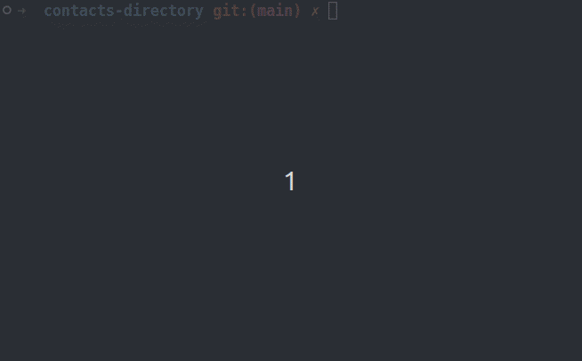
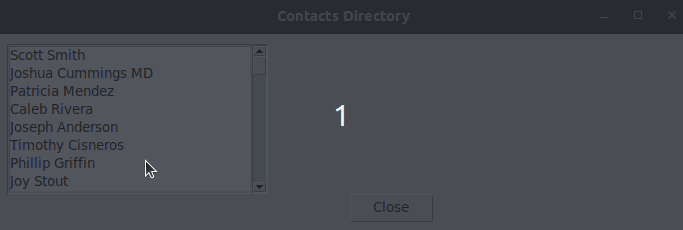

# Contacts Directory

Everyone has people they'd like to stay connect with and one of the most popular ways to go about it is to store all of our contacts. Build a tool to to store and manage your contacts. The contacts are provided in `contacts.csv`. You'll learn:

- File IO 
- `pathlib` 
- `open()`
- `with` (context managers)

Use functions to make your app more modular.

## Features

Your app should have the following features:
- View all contacts
- Find a contact by name
- Add a new contact
- OPTIONAL: Print a numbered list (see example)
- OPTIONAL: Parse phone numbers into a consistent format.
- OPTIONAL: Paginate output
- OPTIONAL: Add color to your terminal output.

Example:

## Advanced Challenges

Create a graphical user interface (UI) using Tkinter (`tk`).

