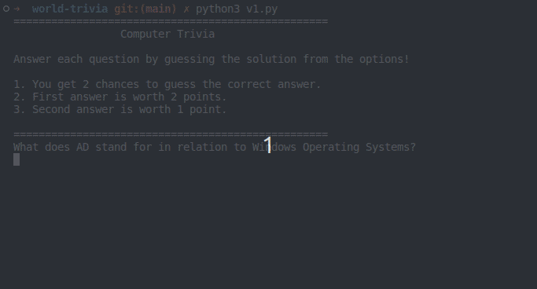

# World Trivia

All data for the trivia game is free courtesy of [Open Trivia DB](https://opentdb.com/api_config.php)!

## Instructions

Build a trivia game that allows users to read questions and type in the correct answer! The game should:

- Track answers
- Track score
- Allow replay at the end of each round
- Use `data.json` as the source for trivia questions and answers.

## Extra Challenge

- Fetch new questions from a new category from Open Trivia DB.
- Use the `logging` module for game messages and to keep a record of debug and exception data.
